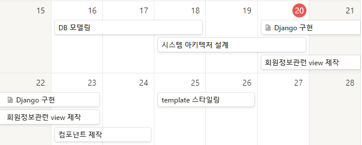
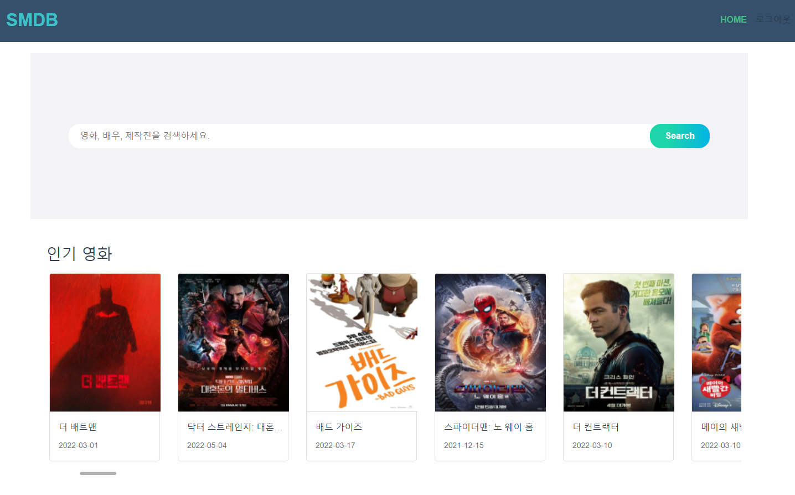
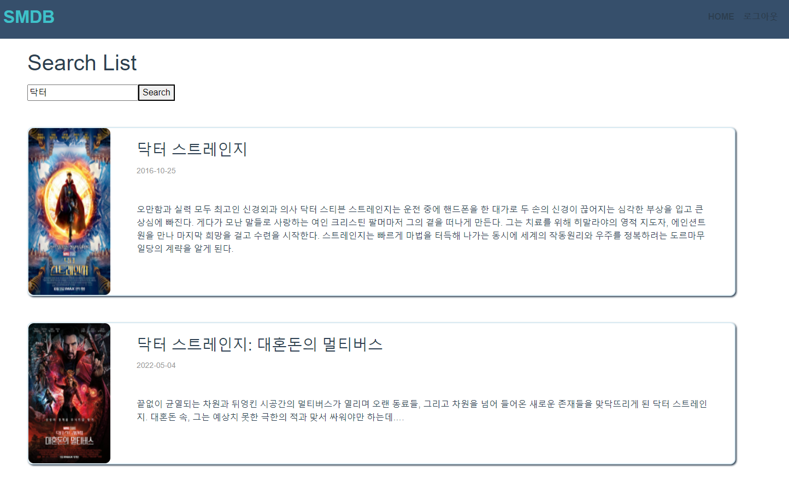
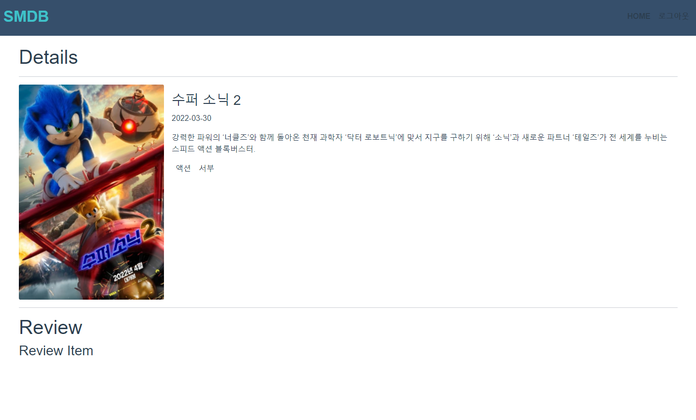
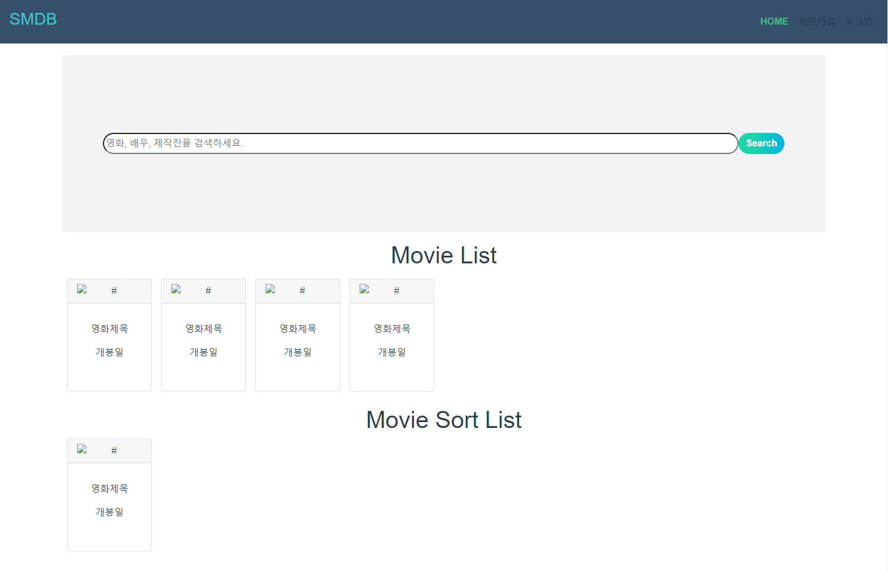
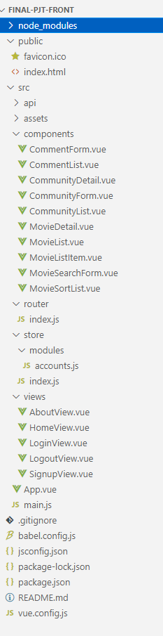

# Movie Project


## 1. 전체 일정




##### #. Django

- Model

- URL
- View
- Serializer
- DB 저장


##### #. Vue

회원정보

- 회원가입

- 로그인

- 로그아웃

- 프로필

  

각각의 template

- 영화  정보리스트

- 영화 상세 정보

- 시청가능한 플랫폼 확인 (DB에저장)

  


## 2. 진행상황

##### 5월 21일

>## Django
>
>> view 제작, DB모델 수정
>
>- Review, comment 모델 , view제작
>- 영화 조회, 등록, 수정, 삭제 기능 구현
>- 리뷰, 코멘트 조회 , 등록, 수정, 삭제 기능 구현
>
>
>
>#### #. Model
>
>```python
>class Review(models.Model):
>    user = models.ForeignKey(settings.AUTH_USER_MODEL, on_delete=models.CASCADE, related_name='reviews')
>    movie = models.ForeignKey(Movie, on_delete=models.CASCADE)
>    title = models.CharField(max_length=200)
>    content = models.TextField()
>    rank = models.IntegerField()
>    created_at = models.DateTimeField(auto_now_add=True)
>    updated_at = models.DateTimeField(auto_now=True)
>
>
>class Comment(models.Model):
>    user = models.ForeignKey(settings.AUTH_USER_MODEL, on_delete=models.CASCADE, related_name='comments')
>    review = models.ForeignKey(Review, on_delete=models.CASCADE, related_name='comments')
>    content = models.CharField(max_length=200)
>    created_at = models.DateTimeField(auto_now_add=True)
>    updated_at = models.DateTimeField(auto_now=True)
>```
>
>
>
>#### #.View
>
>```python
>@api_view(['GET', 'POST'])
>def movie_list(request):
>    if request.method == 'GET':
>        movies = Movie.objects.order_by('-popularity')
>        serializer = MovieSerializer(movies, many=True)
>        return Response(serializer.data)
>    elif request.method == 'POST':
>        serializer = MovieSerializer(data=request.data)
>        if serializer.is_valid(raise_exception=True):
>            serializer.save()
>            return Response(serializer.data, status=status.HTTP_201_CREATED)
>
>
>@api_view(['GET', 'DELETE', 'PUT'])
>def movie_detail(request, movie_pk):
>    movie = get_object_or_404(Movie, pk=movie_pk)
>    if request.method == 'GET':
>        serializer = MovieSerializer(movie)
>        return Response(serializer.data)
>    elif request.method == 'DELETE':
>        movie.delete()
>        data = {
>            'delete': f'{movie.title}이 삭제되었습니다.',
>        }
>        return Response(data, status=status.HTTP_204_NO_CONTENT)
>    elif request.method == 'PUT':
>        serializer = MovieSerializer(movie, request.data)
>        if serializer.is_valid(raise_exception=True):
>            serializer.save()
>            return Response(serializer.data)
>
>
>def cast_list(request):
>    casts = get_list_or_404(Cast)
>    serializer = CastSerializer(casts, many=True)
>    return Response(serializer.data)
>
>def crew_list(request):
>    crews = get_list_or_404(Crew)
>    serializer = CrewSerializer(crews, many=True)
>    return Response(serializer.data)
>
>@api_view(['GET', 'POST'])
>def review_list_or_create(request, movie_pk):
>    def review_list():
>        reviews = get_object_or_404(Movie, pk=movie_pk)
>        serializer = ReviewListSerializer(reviews, many=True)
>        return Response(serializer.data)
>    
>    def create_review():
>        user = request.user
>        review = get_object_or_404(Movie, pk=movie_pk)
>        serializer = ReviewSerializer(data=request.data)
>        if serializer.is_valid(raise_exception=True):
>            serializer.save(review=review, user=user)
>            return Response(serializer.data, status=status.HTTP_201_CREATED)
>
>    if request.method == 'GET':
>        return review_list()
>    elif request.method == 'POST':
>        return create_review()
>
>@api_view(['GET', 'PUT', 'DELETE'])
>def review_detail_or_update_or_delete(request, review_pk):
>    # movie = get_object_or_404(Movie, pk=movie_pk)
>    review = get_object_or_404(Review, pk=review_pk)
>
>    def review_detail():
>        serializer = ReviewSerializer(review)
>        return Response(serializer.data)
>
>    def update_review():
>        if request.user == review.user:
>            serializer = ReviewSerializer(instance=review, data=request.data)
>            if serializer.is_valid(raise_exception=True):
>                serializer.save()
>                return Response(serializer.data)
>
>    def delete_review():
>        if request.user == review.user:
>            review.delete()
>            return Response(status=status.HTTP_204_NO_CONTENT)
>
>    if request.method == 'GET':
>        return review_detail()
>    elif request.method == 'PUT':
>        if request.user == review.user:
>            return update_review()
>    elif request.method == 'DELETE':
>        if request.user == review.user:
>            return delete_review()
>
>@api_view(['POST'])
>def create_comment(request, review_pk):
>    user = request.user
>    review = get_object_or_404(Review, pk=review_pk)
>    
>    serializer = CommentSerializer(data=request.data)
>    if serializer.is_valid(raise_exception=True):
>        serializer.save(review=review, user=user)
>
>        # 기존 serializer 가 return 되면, 단일 comment 만 응답으로 받게됨.
>        # 사용자가 댓글을 입력하는 사이에 업데이트된 comment 확인 불가 => 업데이트된 전체 목록 return 
>        comments = review.comments.all()
>        serializer = CommentSerializer(comments, many=True)
>        return Response(serializer.data, status=status.HTTP_201_CREATED)
>
>
>@api_view(['PUT', 'DELETE'])
>def comment_update_or_delete(request, review_pk, comment_pk):
>    review = get_object_or_404(Review, pk=review_pk)
>    comment = get_object_or_404(Comment, pk=comment_pk)
>
>    def update_comment():
>        if request.user == comment.user:
>            serializer = CommentSerializer(instance=comment, data=request.data)
>            if serializer.is_valid(raise_exception=True):
>                serializer.save()
>                comments = review.comments.all()
>                serializer = CommentSerializer(comments, many=True)
>                return Response(serializer.data)
>
>    def delete_comment():
>        if request.user == comment.user:
>            comment.delete()
>            comments = review.comments.all()
>            serializer = CommentSerializer(comments, many=True)
>            return Response(serializer.data)
>    
>    if request.method == 'PUT':
>        return update_comment()
>    elif request.method == 'DELETE':
>        return delete_comment()
>
>@api_view(['GET'])
>def search_movies(request, keyword):
>    print('1234')
>    movies = Movie.objects.filter(title__contains=keyword)
>    serializer = MovieSerializer(movies, many=True)
>    return Response(serializer.data)
>```
>
>
>
>
>
>## Vue
>
>>검색, 디테일 페이지 제작
>
>- 키워드를 검색하면 해당 키워드가 들어간 영화를 DB에서 검색
>- 상세페이지 영화의 상세정보, 리뷰 컴포넌트 제작
>- 메인페이지 영화 데이터 불러오기
>
>
>
>
>
>
>
>
>
>


##### 5월 20일

> ## Django
>
> >DB, 모델 제작
>
> - 프로젝트 기획 설계
> - 와이어프레임 설계
> - DB 구현 중
>   - TMDB API를 활용하여 데이터를 수집, 가공하여 데이터베이스에 저장 
>   - django 모델 구현
>
> ```python
> from django.db import models
> from django.conf import settings
> from django.core.validators import MaxValueValidator, MinValueValidator
> 
> # Create your models here.
> class Genre(models.Model):
>     name = models.CharField(max_length=50)
> 
> class Cast(models.Model):
>     name = models.CharField(max_length=50)
> 
> class Crew(models.Model):
>     name = models.CharField(max_length=50)
> 
> # class Platform(models.Model):
> #     neflix = models.BooleanField()
> #     watcha = models.BooleanField()
> #     disney = models.BooleanField()
> 
> # class Video(models.Model):
> 
> class Movie(models.Model):
>     genres=models.ManyToManyField(Genre, related_name='movies')
>     casts=models.ManyToManyField(Cast, related_name='movies')
>     crews=models.ManyToManyField(Crew, related_name='movies')
>     title = models.CharField(max_length=100)
>     overview = models.TextField()
>     vote_average = models.FloatField(validators=[MinValueValidator(0), MaxValueValidator(10)])
>     popularity = models.IntegerField()
>     release_date = models.DateTimeField()
>     poster_path = models.TextField()
>     video = models.BooleanField()
> ```
>
> 
>
> 
>
> ## Vue
>
> >뼈대 만드는 작업
>
> 
>
> 
>
> - 메인페이지 디자인 틀 구상 (TMDB 참고. 추후 변경 할 수 있음)
> - 회원가입, 로그인 , 로그아웃 view, Vuex 제작 ( DB준비되면 테스트 필요 )
>
> 
>
> 
>
> - 각 컴포넌트 생성


#### 4. 결과


